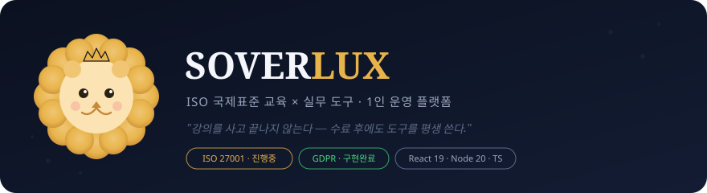
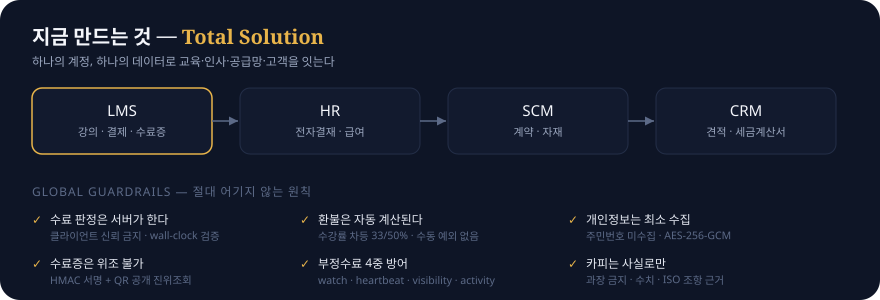

<!--
  GitHub 프로필 README — SVG 중심 구성
  게시: 본인 계정명과 같은 공개 저장소(dsoverlux-sudo/dsoverlux-sudo)를 만들고
        이 README.md + assets/ 폴더를 함께 커밋하면 프로필 상단에 표시됨.
  ※ GitHub 마크다운은 인라인 <svg>를 제거하므로, SVG는 파일로 두고 로 임베드함.
-->

  

  

<!-- 유일한 외부 위젯: GitHub 통계 (다크 네이비 + 골드) -->

  

🦁 경기 김포 · 1인 운영 · ISO 심사원 × 풀스택 빌더

